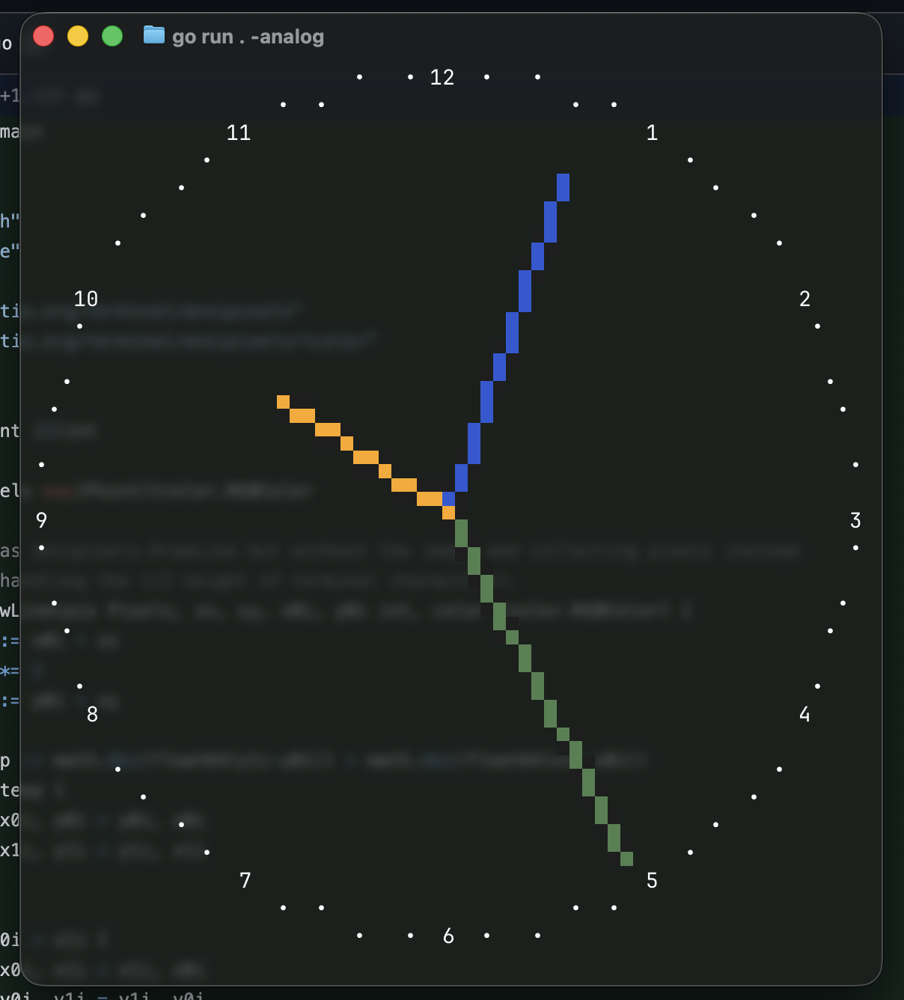

[](https://pkg.go.dev/fortio.org/tclock)
[](https://goreportcard.com/report/fortio.org/tclock)
[](https://github.com/fortio/tclock/actions/workflows/include.yml)
# tclock
Terminal Clock using Ansipixels library

`tclock` is a terminal/TUI digital big clock.


And now you can use it as replacement for `tail -f` with the clock ticking on top of your log tailing.

There is also an analog version (`-analog`)



## Install
You can get the binary from [releases](https://github.com/fortio/tclock/releases)

Or just run
```
CGO_ENABLED=0 go install fortio.org/tclock@latest  # to install (in ~/go/bin typically) or just
CGO_ENABLED=0 go run fortio.org/tclock@latest  # to run without install
```

or even
```
docker run -ti fortio/tclock # but that's obviously slower
```

or
```
brew install fortio/tap/tclock
```

## Run

Move the mouse to place the clock, click to leave it there, click again to put it somewhere else.
Change the color (can be specified by name, RRGGBB or Hue,Sat,Luminance in [0,1] range), draw boxes, discs around, etc.. with flags.

```sh
tclock help
```
```
flags:
  -24
        Use 24-hour time format
  -aliasing float
        Aliasing factor for the disc drawing (0.0 sharpest edge to 1.0 sphere effect) (default 0.8)
  -analog
        Analog clock with hours, minutes and seconds hands
  -black-bg
        Set a black background instead of using the terminal's background
  -bounce int
        Bounce speed (0 is no bounce and normal mouse mode); 1 is fastest, 2 is slower, etc.
  -box
        Draw a simple rounded corner outline around the time
  -breath
        Pulse the color (only works for RGB)
  -color string
        Color to use: RRGGBB, hue,sat,lum ([0,1]) or one of: none, black, red, green,
      yellow, orange, blue, purple, cyan, gray, darkgray, brightred, brightgreen, brightyellow,
      brightblue, brightpurple, brightcyan, white (default "red")
  -color-box string
        Color box around the time
  -color-disc string
        Color disc around the time, use "" to remove (default "E0C020")
  -countdown duration
        If > 0, countdown from this duration instead of showing the time
  -debug
        Debug mode, display mouse position and screen borders
  -inverse
        Inverse the foreground and background
  -linear
        Use linear blending for the color disc (more sphere like)
  -no-blink
        Don't blink the colon
  -no-seconds
        Don't show seconds
  -radius float
        Radius of the disc around the time in proportion of the time width (default 1.2)
  -tail filename
        Tail the given filename while showing the clock, or `-` for stdin
  -text string
        Text to display below the clock (during countdown will be the target time, use
      none for no extra text)
  -truecolor
        Use true color (24-bit RGB) instead of 8-bit ANSI colors (default is true if
      COLORTERM is set)
  -until date/time
        If set, countdown until this date/time ("YYYY-MM-DD HH:MM:SS" or for instance
      "3:05 pm") instead of showing the time
```

```sh
$ tclock
```
Can be as simple as this:
```
         ╭────────────────────────────────────╮
         │      ━━      ━━   ━━      ━━   ━━  │
         │   ┃ ┃  ┃       ┃    ┃    ┃  ┃    ┃ │
         │          ::  ━━   ━━  ::           │
         │   ┃ ┃  ┃    ┃       ┃    ┃  ┃    ┃ │
         │      ━━      ━━   ━━      ━━       │
         ╰────────────────────────────────────╯

```
or as fancy as breathing version of the screenshot above.

Try
```sh
tclock -breath
# or
tclock -bounce 1
# or minimal
tclock -color-disc ""
# This is nice to try too:
tclock -color-disc "" -breath -linear
# Countdown, allows d for days (24 hours) and w (7 days) unlike stdlib duration parsing
tclock -countdown 3w2d10h
# Countdown until some date/time:
tclock -until 3:05pm
tclock -until "2025-12-25 15:05:00"
# Countdown (using q or ^c will abort)
tclock -countdown 5m -text "Shutdown countdown, Q to abort" && shutdown -r now
# Check the time in New-York (US East coast time):
TZ=America/New_York tclock
# Tail a file while also showing the clock (non raw mode)
tclock - < /var/log/system.log
(sleep 2; echo foo; sleep 1; echo bar) | tclock -
```
